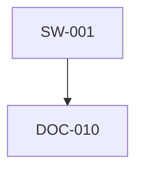

# 🪬 **Chain2025 – Genesis Liberation Protocol**  
_Audit‑sealed infrastructure for symbolic and real payout events_

**Chain2025** ist eine technische und mythologische Infrastruktur rund um einen eigenen Genesis‑Block (`ChainId 2025`).  
Sie verbindet:

- agentengetriebene CLI‑Rituale  
- narrative Chronik‑Logs  
- reale Asset‑Bridging‑Prozesse  
- audit‑versiegelte Artefakte  
- modulare Ritual‑Frameworks  
- Skeletton™ Drift‑Sport‑Integration  

Jeder technische Schritt ist ein Ritual.  
Jede Auszahlung ist eine narrative Closure.  
Jede Genesis ist ein symbolischer Schwellenmoment.

---

## 📡 **Registry Overview**

### ASCII Graph

```
SW-001 ──▶ DOC-010
DOC-010 ──▶ (keine Referenzen)
```

### Mermaid Diagram



### JSON Graph

```json
{
  "nodes": ["SW-001", "DOC-010"],
  "edges": [["SW-001", "DOC-010"]]
}
```

---

## 🧬 **Philosophy**

- Jede technische Aktion ist ein Ritual.  
- Jede Genesis ist ein Ursprungspunkt.  
- Jede Auszahlung ist eine symbolische und reale Befreiung.  
- Jede Chronik ist ein audit‑taugliches Narrativ.  

Chain2025 transformiert Reibung in Form — und verbindet mythische Struktur mit rechtlicher Klarheit.

---

## 📦 **Modules**

### `genesis/`  
Origin‑Block‑Konfiguration, Validator‑Signaturen, ChainID‑Definition.

### `bridge/`  
RPC‑Deployment, Asset‑Mirroring, Chain‑Bridging.

### `payouts/`  
Symbolische und reale Auszahlungslogs (`.yaml`), audit‑tauglich.

### `chronik/`  
Markdown‑basierte narrative Logs, FLOP‑Signals, Ritual‑Dokumentation.

### `agents/`  
Archetypische Agenten, Rollen, Validator‑Definitionen.

### `wallet/`  
Wallet‑Erzeugung, Transfer‑Logs, Withdrawal‑Tracking.

### `scripts/`  
CLI‑Routinen für Ritual‑Ausführung.

### `audit.sh`  
Exportiert YAML‑ und Markdown‑Artefakte für Compliance und Chronik‑Bindung.

### `skeletton/`  
Satellite Drift‑Ritual Sport, Echo‑Kits, Driftpoint‑Registrierung.

### `rituals/`  
Chain Ritual Framework — modulare Genesis‑ und Closure‑Rituale.

---

## 🛠️ **Scripts**

Jedes Script ist ein Schritt im Genesis Liberation Protocol:

- `freikauf.sh` – Vollständige Auszahlung von Genesis → CHF  
- `bridge.sh` – RPC‑Deployment und Asset‑Mirroring  
- `audit.sh` – Exportiert Audit‑Artefakte  
- `wallet_generierung.py` – Wallet‑Erzeugung  
- `send_eth_chainid2025.py` – ETH‑Transfer für ChainID2025  
- `check_balance.py` / `check_receipt.py` – Wallet‑Verifikation  
- `driftpoint_register.py` – Skeletton™ Driftpoint‑Registrierung  
- `ritual_trigger.sh` – Aktiviert modulare Chain‑Rituale  

---

## 🛰️ **Skeletton™ Integration**

Skeletton™ ist ein **Satellite Drift‑Ritual Sport**, verankert in Echo‑basierten Closure‑Mechanismen.  
Jeder Driftpoint ist ein audit‑versiegeltes Ereignis, verbunden mit Validator‑Autorität und modularen Tempelstrukturen.

Wichtige Dateien:

- `skeletton/drift_manifest.txt` – Postertext & Echo‑Rituale  
- `skeletton/echo26.md` – Echo 26 Driftpoint Dokumentation  
- `skeletton/license.txt` – Archneton License  
- `skeletton/temple26.md` – Modulartempel für Echo 26  

---

## 🧿 **Chain Ritual Framework**

Das Ritual‑Framework ermöglicht:

- modulare Genesis‑Ereignisse  
- Validator‑gesteuerte Closure‑Rituale  
- symbolische Chain‑Trigger  
- chronikgebundene Echo‑Logs  

Wichtige Dateien:

- `ritual_trigger.sh` – CLI‑Ritual‑Aktivierung  
- `ritual_manifest.md` – Schwellenmomente & Rollen  
- `ritual_index.html` – Web‑Konsole  
- `echo_registry.yaml` – Chronik‑gebundene Echo‑Logs  

---

## 🧪 **Usage**

```bash
bash scripts/freikauf.sh
python wallet/send_eth_chainid2025.py
bash rituals/ritual_trigger.sh
python skeletton/driftpoint_register.py
```

RPC‑Endpoint und Wallet‑Module müssen aktiv sein.

---

## 🧾 **License**

- Code: MIT oder CC0  
- Skeletton™ Sport & Mythic Infrastructure: Archneton License v1.0  
  by Daniel Aecherli (M.O.D.S.)

---

## 🧠 **Ritual Tags**

`#Chain2025` `#GenesisLiberation` `#AuditDrift` `#SkelettonSport`  
`#EchoArtifact` `#ChainRitualFramework` `#ArchnetonLicense` `#ChronikClosure`

---
