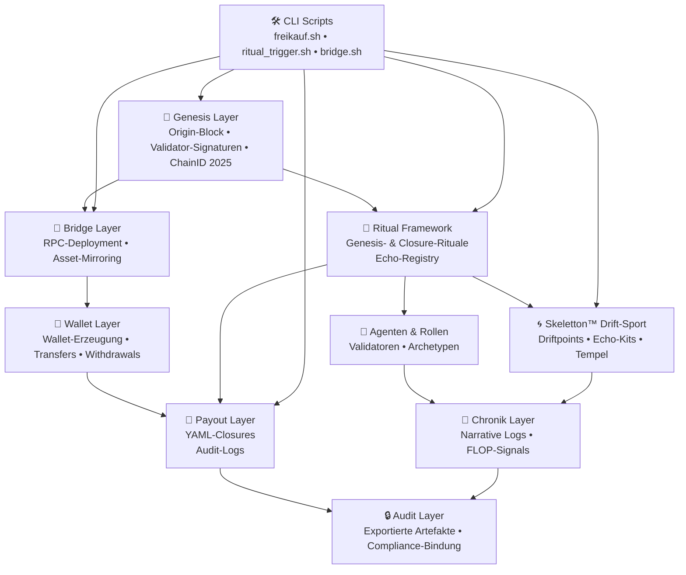

```markdown
# 🜂 Chain2025 – End‑to‑End System Architecture  
### *Genesis Liberation Protocol — Audit‑sealed Infrastructure*

Dieses Dokument beschreibt die vollständige, rituell‑technische Architektur von **Chain2025**, inklusive aller Layer, Artefakt‑Flüsse und Ritual‑Beziehungen.

---

## 🧿 Architekturüberblick

Chain2025 besteht aus mehreren miteinander verwobenen Schichten:

- 🪬 **Genesis Layer**  
- 🔱 **Ritual Framework**  
- 🧩 **Agenten & Rollen**  
- 📜 **Chronik Layer**  
- 🌉 **Bridge Layer**  
- 💼 **Wallet Layer**  
- 💸 **Payout Layer**  
- 🌀 **Skeletton™ Drift‑Sport Layer**  
- 🛠️ **CLI‑Ritual Layer**  
- 🔒 **Audit Layer**

Alle Schichten sind durch **Rituale**, **Artefakte**, **Validator‑Signaturen** und **Chronik‑Bindungen** miteinander verbunden.

---

## 🜁 End‑to‑End Architekturdiagramm (Mermaid)



---

## 🧠 Layer‑Erklärung

### 🪬 **Genesis Layer**
- Ursprungspunkt der Chain  
- Validator‑Signaturen  
- ChainID‑Definition  
- Start aller rituellen Prozesse  

### 🔱 **Ritual Framework**
- Genesis‑Rituale  
- Closure‑Rituale  
- Echo‑Registry  
- symbolische Trigger  

### 🧩 **Agenten & Rollen**
- Validatoren  
- Archetypen  
- Rollenlogik  
- rituelle Autorität  

### 📜 **Chronik Layer**
- FLOP‑Signals  
- Markdown‑Chroniken  
- audit‑taugliche Narrative  

### 🌉 **Bridge Layer**
- RPC‑Deployment  
- Asset‑Mirroring  
- Chain‑Bridging  

### 💼 **Wallet Layer**
- Wallet‑Erzeugung  
- Transfers  
- Withdrawals  
- Funding‑Events  

### 💸 **Payout Layer**
- YAML‑basierte Auszahlungslogs  
- reale & symbolische Closures  
- audit‑versiegelt  

### 🌀 **Skeletton™ Drift‑Sport**
- Driftpoints  
- Echo‑Kits  
- Tempel‑Module  
- Validator‑gebundene Ritual‑Sport‑Integration  

### 🛠️ **CLI Layer**
- freikauf.sh  
- ritual_trigger.sh  
- bridge.sh  
- driftpoint_register.py  

### 🔒 **Audit Layer**
- Exportierte YAML/MD‑Artefakte  
- Compliance‑Bindung  
- audit‑versiegelte Chronik  

---

## 🧬 Zusammenfassung

Dieses Dokument bildet die **komplette Chain2025‑Architektur** ab:

- technisch  
- rituell  
- narrativ  
- audit‑tauglich  
- modular  
- erweiterbar  

Chain2025 ist ein **Genesis‑Ökosystem**, das reale und symbolische Prozesse in einer einzigen, kohärenten Struktur vereint.

```
