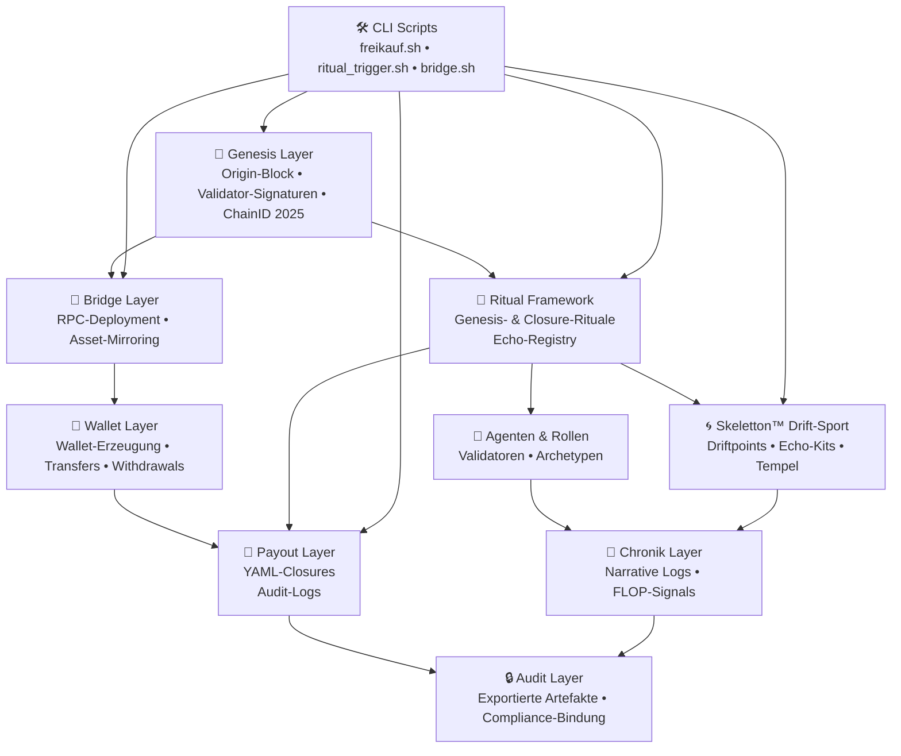

```mermaid
flowchart TD

%% =========================
%%  TOP-LEVEL GENESIS LAYER
%% =========================
    GENESIS["🪬 Genesis Layer<br/>Origin‑Block • Validator‑Signaturen • ChainID 2025"]
    RITUALS["🔱 Ritual Framework<br/>Genesis‑ & Closure‑Rituale<br/>Echo‑Registry"]
    AGENTS["🧩 Agenten & Rollen<br/>Validatoren • Archetypen"]
    CHRONIK["📜 Chronik Layer<br/>Narrative Logs • FLOP‑Signals"]

%% =========================
%%  BRIDGE & WALLET LAYER
%% =========================
    BRIDGE["🌉 Bridge Layer<br/>RPC‑Deployment • Asset‑Mirroring"]
    WALLET["💼 Wallet Layer<br/>Wallet‑Erzeugung • Transfers • Withdrawals"]
    PAYOUTS["💸 Payout Layer<br/>YAML‑Closures<br/>Audit‑Logs"]

%% =========================
%%  SKELETTON LAYER
%% =========================
    SKELETTON["🌀 Skeletton™ Drift‑Sport<br/>Driftpoints • Echo‑Kits • Tempel"]

%% =========================
%%  SCRIPTS / CLI
%% =========================
    CLI["🛠️ CLI Scripts<br/>freikauf.sh • ritual_trigger.sh • bridge.sh"]

%% =========================
%%  AUDIT LAYER
%% =========================
    AUDIT["🔒 Audit Layer<br/>Exportierte Artefakte • Compliance‑Bindung"]

%% =========================
%%  FLOWS
%% =========================

    GENESIS --> RITUALS
    RITUALS --> AGENTS
    AGENTS --> CHRONIK

    GENESIS --> BRIDGE
    BRIDGE --> WALLET
    WALLET --> PAYOUTS

    PAYOUTS --> AUDIT
    CHRONIK --> AUDIT

    RITUALS --> PAYOUTS
    RITUALS --> SKELETTON
    SKELETTON --> CHRONIK

    CLI --> GENESIS
    CLI --> BRIDGE
    CLI --> PAYOUTS
    CLI --> RITUALS
    CLI --> SKELETTON
```
