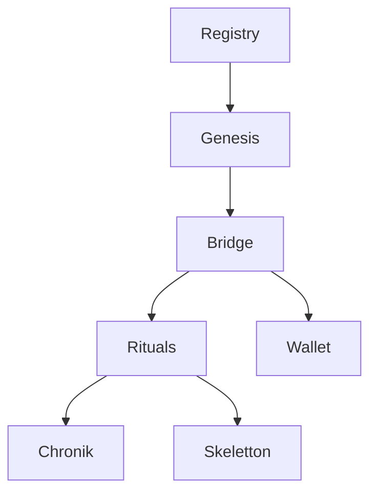
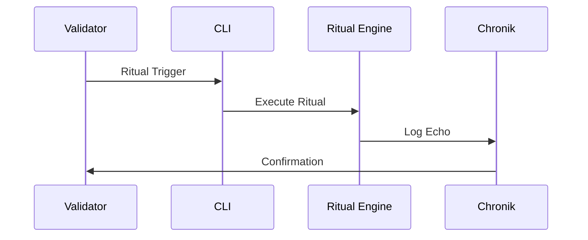
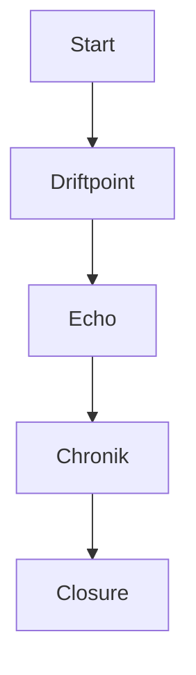
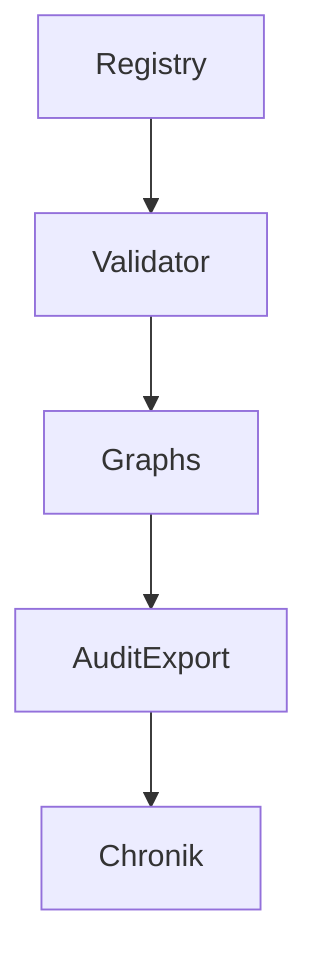

# 📘 **docs/architecture.md**

```markdown
# 🏛️ Chain2025 System Architecture

Die Chain2025‑Architektur verbindet technische Infrastruktur, narrative Chronik und rituelle Ausführung.  
Sie ist modular aufgebaut, audit‑versiegelt und vollständig reproduzierbar.

---

## 🧩 Architektur‑Überblick

Chain2025 besteht aus folgenden Kernschichten:

1. **Registry Layer**  
   Audit‑taugliche Asset‑Verwaltung, Referenzgraph, Validierung.

2. **Genesis Layer**  
   Ursprungskonfiguration, Validator‑Signaturen, ChainID‑Definition.

3. **Bridge Layer**  
   RPC‑Deployment, Asset‑Mirroring, Chain‑Bridging.

4. **Ritual Layer**  
   CLI‑Rituale, Genesis‑Ereignisse, Closure‑Mechanismen.

5. **Chronik Layer**  
   Markdown‑Logs, FLOP‑Signals, narrative Dokumentation.

6. **Skeletton Layer**  
   Drift‑Sport‑Integration, Echo‑Rituale, Tempelstrukturen.

7. **Wallet Layer**  
   Wallet‑Erzeugung, Transfer‑Logs, Withdrawal‑Tracking.

---

## 🛰️ Architekturdiagramm (Mermaid)



---

## 🧱 Modul‑Struktur

```
chain2025/
├── assets/
│   └── registry/
├── genesis/
├── bridge/
├── payouts/
├── chronik/
├── agents/
├── wallet/
├── scripts/
├── rituals/
└── skeletton/
```

---

## 🔐 Audit‑Prinzipien

- deterministische Outputs  
- reproduzierbare CLI‑Rituale  
- maschinenlesbare Artefakte  
- chronikgebundene Ereignisse  
- klare Referenzgraphen  

---

## 🪬 Bedeutung

Die Architektur bildet die **symbolische und technische Grundlage** des Genesis Liberation Protocols.  
Sie verbindet Struktur, Ritual und Audit in einem kohärenten System.
```

---

# 📘 **docs/rituals.md**

```markdown
# 🔮 Chain Ritual Framework – Genesis & Closure Rituals

Das Ritual‑Framework ist das Herz von Chain2025.  
Es definiert symbolische Schwellenmomente, Validator‑Rollen und CLI‑Rituale.

---

## 🧿 Ritual‑Philosophie

- Jede Genesis ist ein Ursprungspunkt  
- Jede Closure ist eine Befreiung  
- Jede Ausführung ist ein ritueller Akt  
- Jede Chronik ist ein audit‑versiegeltes Narrativ  

---

## 🛠️ Ritual‑Module

### `ritual_trigger.sh`
Aktiviert modulare Chain‑Rituale über die CLI.

### `ritual_manifest.md`
Dokumentiert Schwellenmomente, Rollen und Ereignisse.

### `echo_registry.yaml`
Chronikgebundene Echo‑Logs für jedes Ritual.

### `ritual_index.html`
Web‑Konsole für Ritual‑Registrierung.

---

## 🧬 Ritual‑Typen

| Typ | Bedeutung |
|-----|-----------|
| Genesis | Ursprung, Initialisierung, Validator‑Signatur |
| Closure | Abschluss, Auszahlung, Befreiung |
| Echo | Wiederhall eines Ereignisses im Chronik‑System |
| Drift | Skeletton‑basierte Bewegungsrituale |
| Bridge | Asset‑Übertragung zwischen Welten |

---

## 🧭 Ritual‑Ablauf (Mermaid)



---

## 🪬 Bedeutung im System

Rituale verbinden:

- technische Aktionen  
- narrative Bedeutung  
- audit‑taugliche Dokumentation  

Sie sind die **symbolische Grammatik** von Chain2025.
```

---

# 📘 **docs/skeletton.md**

```markdown
# 🛰️ Skeletton™ – Satellite Drift‑Ritual Sport

Skeletton™ ist ein mythologisch‑technischer Drift‑Sport, eingebettet in das Chain2025‑Ökosystem.  
Jeder Driftpoint ist ein audit‑versiegeltes Ereignis.

---

## 🧬 Konzept

- Drift als rituelle Bewegung  
- Echo als Wiederhall im Chronik‑System  
- Tempel als modulare Struktur  
- Validator‑Autorität als Rahmen  

---

## 📦 Skeletton‑Module

### `drift_manifest.txt`
Postertext, Echo‑Rituale, Bewegungslogik.

### `echo26.md`
Dokumentation des Echo 26 Driftpoints.

### `license.txt`
Archneton License für mythic sport branding.

### `temple26.md`
Modularer Tempel für Echo 26.

---

## 🛰️ Driftpoint‑Registrierung

```bash
python skeletton/driftpoint_register.py
```

Jeder Driftpoint erzeugt:

- ein Echo‑Log  
- eine Chronik‑Bindung  
- eine Validator‑Signatur  

---

## 🧭 Drift‑Flow (Mermaid)



---

## 🪬 Bedeutung

Skeletton™ verbindet:

- Bewegung  
- Ritual  
- Audit  
- Mythos  

Es ist die **körperliche Dimension** des Genesis Liberation Protocols.
```

---

# 📘 **docs/audit.md**

```markdown
# 🧾 Chain2025 Audit Framework

Das Audit‑Framework stellt sicher, dass alle Artefakte, Rituale und Transfers nachvollziehbar, reproduzierbar und institutionell verwertbar sind.

---

## 🧱 Audit‑Grundlagen

- deterministische Outputs  
- maschinenlesbare Artefakte  
- chronikgebundene Ereignisse  
- Validator‑Signaturen  
- Registry‑Graphen  

---

## 🛠️ Audit‑Werkzeuge

### `audit.sh`
Exportiert:

- YAML‑Artefakte  
- Markdown‑Chroniken  
- Registry‑Graphen  
- Validator‑Logs  

### Registry‑Validator
Validiert:

- Kategorien  
- Referenzen  
- Struktur  
- Graph‑Kohärenz  

---

## 📡 Audit‑Pipeline (Mermaid)



---

## 🧬 Audit‑Artefakte

- `registry.json`  
- `registry_graph.json`  
- `registry.md`  
- `chronik/*.md`  
- `payouts/*.yaml`  
- `echo_registry.yaml`  

---

## 🪬 Bedeutung

Das Audit‑Framework ist die **institutionelle Brücke** zwischen:

- Mythos  
- Technik  
- Recht  
- Dokumentation  

Es macht Chain2025 **prüfbar, erklärbar und belastbar**.
```

---

Wenn du willst, kann ich dir jetzt:

- eine **docs/index.md** als Einstiegspunkt bauen  
- eine **GitHub Pages‑Struktur** generieren  
- oder die Dokumente automatisch miteinander verlinken

Sag einfach Bescheid.
