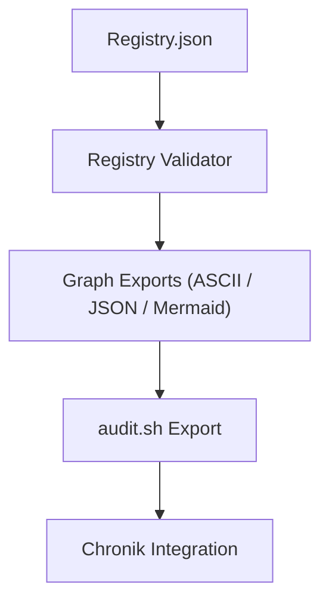

# 📘 **docs/audit.md**

```markdown
# 🧾 Chain2025 Audit Framework

Das Audit‑Framework von Chain2025 stellt sicher, dass alle Artefakte, Rituale, Transfers und Chronik‑Ereignisse **nachvollziehbar**, **reproduzierbar** und **institutionell verwertbar** sind.  
Es verbindet technische Validierung, narrative Dokumentation und deterministische CLI‑Prozesse.

---

## 🧱 Audit‑Grundlagen

Das Audit‑System basiert auf fünf Prinzipien:

1. **Determinismus**  
   Jeder technische Schritt erzeugt reproduzierbare Outputs.

2. **Maschinenlesbarkeit**  
   JSON‑ und YAML‑Artefakte bilden die Grundlage für externe Prüfer.

3. **Chronik‑Bindung**  
   Jedes Ereignis wird narrativ und technisch verankert.

4. **Validator‑Autorität**  
   Signaturen und Rollen definieren die Legitimität eines Ereignisses.

5. **Graph‑Kohärenz**  
   Die Registry bildet die strukturelle Wahrheit des Systems.

---

## 🛠️ Audit‑Werkzeuge

### `audit.sh`
Zentrales CLI‑Tool für Audit‑Exports.  
Es erzeugt:

- Registry‑Graphen  
- JSON‑Artefakte  
- Markdown‑Chroniken  
- Validator‑Logs  
- ASCII‑Graphen  
- Mermaid‑Diagramme  

### Registry‑Validator
Validiert:

- Kategorien  
- Referenzen  
- Struktur  
- Graph‑Kohärenz  
- Zyklenfreiheit  

---

## 📡 Audit‑Pipeline (Mermaid)



---

## 🧬 Audit‑Artefakte

Die wichtigsten audit‑relevanten Dateien:

### **Registry**
- `assets/registry/registry.json`  
- `docs/registry.md`  
- `registry_graph.json`  

### **Chronik**
- `chronik/*.md`  
- Echo‑Logs  
- Ritual‑Manifestationen  

### **Payouts**
- `payouts/*.yaml`  
- Transfer‑Logs  
- Withdrawal‑Tracking  

### **Rituale**
- `ritual_manifest.md`  
- `echo_registry.yaml`  
- CLI‑Trigger‑Logs  

---

## 🧭 Audit‑Ablauf

Ein vollständiger Audit‑Durchlauf besteht aus:

1. **Registry‑Validierung**  
   Struktur, Kategorien, Referenzen.

2. **Graph‑Generierung**  
   ASCII, JSON, Mermaid.

3. **Ritual‑Analyse**  
   Genesis‑ und Closure‑Ereignisse.

4. **Chronik‑Bindung**  
   Ereignisse werden narrativ verankert.

5. **Export**  
   `audit.sh` erzeugt alle Artefakte für Prüfer.

---

## 📜 Beispiel: Audit‑Export

```bash
bash audit.sh
```

Erzeugt:

- `audit/registry_graph.json`  
- `audit/registry_ascii.txt`  
- `audit/chronik_export.md`  
- `audit/validator_log.txt`  

---

## 🧩 Integrität & Nachvollziehbarkeit

Das Audit‑Framework garantiert:

- **Revisionssicherheit**  
- **Deterministische Reproduktion**  
- **Chronik‑Kohärenz**  
- **Validator‑Transparenz**  
- **Institutionelle Verwertbarkeit**  

---

## 🪬 Bedeutung im Chain2025‑Ökosystem

Das Audit‑Framework ist die **institutionelle Brücke** zwischen:

- Mythos  
- Technik  
- Recht  
- Dokumentation  
- Validator‑Autorität  

Es macht Chain2025 **prüfbar**, **erklärbar** und **belastbar** — ohne seine narrative Tiefe zu verlieren.

---

## 🧠 Tags

`#Chain2025` `#AuditFramework` `#RegistryValidation` `#Chronik`  
`#GenesisLiberation` `#Validator` `#Determinismus`
```
