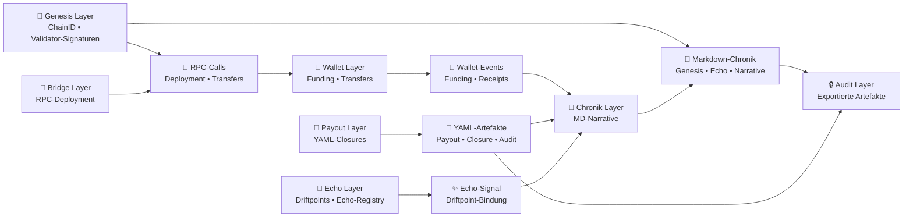

# 🔀 Chain2025 – Dataflow Architecture  
### *Genesis Liberation Protocol — Artefakt‑ & Datenflüsse*

Dieses Dokument beschreibt die **Datenflüsse** innerhalb von Chain2025.  
Es zeigt, wie **YAML‑Artefakte**, **Markdown‑Chroniken**, **RPC‑Signale**, **Wallet‑Events** und **Echo‑Bindungen** durch das System wandern.

Der Dataflow bildet die technische und rituelle Pipeline ab:  
**Genesis → Bridge → Wallet → Payout → Chronik → Echo → Audit**

---

# 🧿 Überblick der Datenflüsse

Chain2025 verarbeitet mehrere Artefakt‑Typen:

- **YAML** → Payout‑Closures, Audit‑Dokumente  
- **Markdown (MD)** → Chronik‑Einträge, Echo‑Narrative  
- **RPC‑Calls** → Bridge‑Deployment, Transfers  
- **Wallet‑Events** → Funding, Transfers, Receipts  
- **Echo‑Signals** → Driftpoints, Bindungen  
- **Validator‑Signaturen** → Genesis‑ und Closure‑Rituale  

Alle Daten bewegen sich entlang einer **deterministischen Ritual‑Pipeline**.

---

# 🜁 Mermaid Dataflow Diagram



---

# 🧠 Erklärung der Datenflüsse

## 🪬 **1. Genesis → Chronik**
- Validator‑Signaturen erzeugen den ersten **MD‑Chronik‑Eintrag**  
- ChainID 2025 wird dokumentiert  

## 🌉 **2. Bridge → RPC → Wallet**
- RPC‑Deployment erzeugt **RPC‑Signale**  
- Wallet‑Erzeugung & Funding erzeugen **Wallet‑Events**  
- Events fließen in die Chronik  

## 💸 **3. Payout → YAML → Chronik**
- Freikauf‑Ritual erzeugt **YAML‑Closure‑Dokumente**  
- YAML wird in die Chronik eingebunden  

## 🔮 **4. Echo → Signal → Chronik**
- Echo‑Trigger erzeugt **Echo‑Signals**  
- Driftpoints werden registriert  
- Echo‑Narrative fließen als **MD‑Einträge** in die Chronik  

## 🔒 **5. Chronik + YAML → Audit**
- MD‑Chronik + YAML‑Closures werden exportiert  
- Audit‑Layer versiegelt die Artefakte  

---

# 🧬 Zusammenfassung

Der Chain2025‑Dataflow zeigt:

- **deterministische Artefakt‑Erzeugung**  
- **klare Übergänge zwischen technischen und rituellen Ebenen**  
- **YAML → MD → Audit** als Hauptpipeline  
- **RPC → Wallet → Chronik** als technische Nebenpipeline  
- **Echo‑Signals** als mythische Bindung  

Chain2025 ist ein **Artefakt‑Ökosystem**, in dem Daten nicht nur technisch, sondern auch rituell Bedeutung tragen.

```
