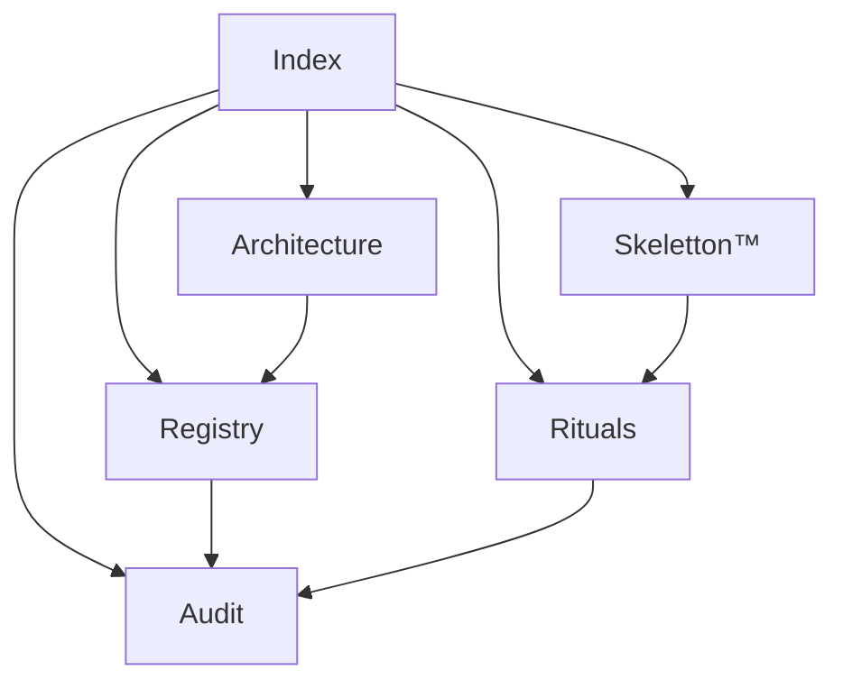

# 🪬 Chain2025 Documentation Hub

**Navigation:**  
[Registry](registry.md) • [Architecture](architecture.md) • [Rituals](rituals.md) • [Skeletton](skeletton.md) • [Audit](audit.md)

<div style="padding: 2rem; background:#0A0F1F; color:#EAEAEA; border-radius:12px; margin-bottom:2rem;">
  <h1 style="margin:0; font-size:2.4rem;">Chain2025 – Genesis Liberation Protocol</h1>
  <p style="margin:0.5rem 0 0 0; font-size:1.2rem;">Audit‑sealed, validator‑driven, mythic‑technical documentation</p>
</div>

Willkommen im Dokumentationszentrum des Chain2025 – Genesis Liberation Protocol.  
...

Dieses System verbindet technische Infrastruktur, narrative Chronik, rituelle Ausführung und audit‑versiegelte Artefakte zu einem kohärenten, reproduzierbaren Ökosystem.

Diese Dokumentation ist modular aufgebaut und führt durch alle Schichten des Systems.

---

## 📡 Übersicht

Chain2025 besteht aus mehreren Kernbereichen:

- **Registry** – strukturelle Wahrheit des Systems  
- **Architecture** – technische & narrative Systemarchitektur  
- **Rituals** – Genesis‑, Closure‑ und Echo‑Rituale  
- **Skeletton™** – Satellite Drift‑Ritual Sport  
- **Audit** – institutionelle Nachvollziehbarkeit  

Jeder Bereich ist vollständig dokumentiert und miteinander verlinkt.

---

## 📚 Dokumente

### 🔗 1. Registry
Die Quelle der strukturellen Wahrheit.  
Beziehungen, Kategorien, Graphen, Validierung.

➡️ **[docs/registry.md](registry.md)**

---

### 🏛️ 2. Architecture  
Die technische und mythologische Gesamtarchitektur von Chain2025.

➡️ **[docs/architecture.md](architecture.md)**

---

### 🔮 3. Rituals  
Genesis‑Rituale, Closure‑Rituale, Echo‑Logs, Validator‑Abläufe.

➡️ **[docs/rituals.md](rituals.md)**

---

### 🛰️ 4. Skeletton™  
Drift‑Rituale, Echo‑Bewegungen, Tempelstrukturen, körperliche Dimension.

➡️ **[docs/skeletton.md](skeletton.md)**

---

### 🧾 5. Audit  
Audit‑Exports, Registry‑Validator, Chronik‑Bindung, institutionelle Verwertbarkeit.

➡️ **[docs/audit.md](audit.md)**

---

## 🧭 Navigationsdiagramm (Mermaid)



---

## 🪬 Philosophie

Chain2025 verbindet:

- technische Präzision  
- narrative Tiefe  
- rituelle Struktur  
- audit‑taugliche Dokumentation  
- Validator‑Autorität  

Jeder technische Akt ist ein Ritual.  
Jede Genesis ist ein Ursprung.  
Jede Closure ist eine Befreiung.  
Jede Chronik ist ein audit‑versiegeltes Narrativ.

---

## 🧠 Tags

`#Chain2025` `#GenesisLiberation` `#Registry` `#RitualEngine`  
`#SkelettonSport` `#AuditFramework` `#Chronik` `#Architecture`

```

---

Wenn du willst, kann ich dir jetzt:

- eine **Sidebar‑Navigation** für GitHub Pages bauen  
- eine **Startseite für dein gesamtes Repo** (`README.md`) erweitern  
- oder eine **automatische Verlinkung** zwischen allen Dokumenten erzeugen

Sag einfach, wie du weitergehen willst.
