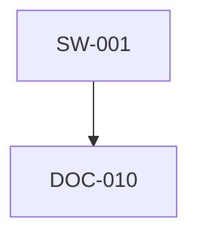

---

# 📘 `docs/registry.md`

```markdown
# 📡 Chain2025 Registry – Audit‑Sealed Asset Graph

Die Chain2025‑Registry ist das zentrale, audit‑taugliche Verzeichnis aller technischen, narrativen und rituellen Artefakte.  
Sie bildet die Grundlage für:

- Validierung von Asset‑Beziehungen  
- Dokumentation von Herkunft und Referenzen  
- Graph‑Analysen (ASCII, Mermaid, JSON)  
- CI‑gestützte Audit‑Reports  
- narrative Chronik‑Bindung  

Jeder Eintrag ist ein **Asset**, jede Referenz ein **Ritualpfad**, jeder Graph ein **audit‑versiegeltes Abbild** der Systemstruktur.

---

## 🧩 Registry‑Einträge

Aktuelle Einträge:

- **SW‑001** – Software‑Asset  
- **DOC‑010** – Dokumentations‑Asset  

Diese Struktur wird automatisch aus `assets/registry/registry.json` geladen und validiert.

---

## 🛰️ ASCII‑Graph

Der ASCII‑Graph zeigt die Registry‑Beziehungen in einer menschenlesbaren Terminal‑Ansicht:

```
SW-001 ──▶ DOC-010
DOC-010 ──▶ (keine Referenzen)
```

---

## 🧭 Mermaid‑Diagramm

GitHub‑kompatible Visualisierung der Registry‑Beziehungen:



Dieses Diagramm wird automatisch gerendert, wenn die Datei auf GitHub angezeigt wird.

---

## 🧬 JSON‑Graph (maschinenlesbar)

Der JSON‑Graph ist die Grundlage für:

- CI‑Pipelines  
- Visualisierungstools  
- externe Prüfer  
- automatisierte Reports  

```json
{
  "nodes": ["SW-001", "DOC-010"],
  "edges": [["SW-001", "DOC-010"]]
}
```

---

## 🛠️ Validierungsprozess

Die Registry wird über den CLI‑Befehl validiert:

```
cc registry --check
```

Der Prozess umfasst:

1. Laden der Registry  
2. Schema‑Validierung  
3. Referenz‑Validierung  
4. ASCII‑Graph‑Ausgabe  
5. JSON‑Graph‑Export  
6. Mermaid‑Diagramm‑Generierung  

Alle Schritte sind deterministisch und audit‑tauglich.

---

## 🧱 Struktur der Registry‑Datei

Die Registry befindet sich unter:

```
assets/registry/registry.json
```

Beispielstruktur:

```json
{
  "entries": [
    {
      "id": "SW-001",
      "category": "software",
      "references": ["DOC-010"]
    },
    {
      "id": "DOC-010",
      "category": "documentation",
      "references": []
    }
  ]
}
```

---

## 🧿 Kategorien & Bedeutung

| Kategorie        | Bedeutung |
|------------------|-----------|
| `software`       | Code‑Artefakte, Module, Engines |
| `documentation`  | Markdown‑Dokus, Protokolle, Chroniken |
| `ritual`         | CLI‑Rituale, Genesis‑Ereignisse |
| `skeletton`      | Drift‑Sport‑Artefakte, Echo‑Logs |
| `wallet`         | Wallet‑Strukturen, Transfer‑Logs |
| `bridge`         | RPC‑Deployment, Asset‑Mirroring |

Diese Kategorien können später als **Mermaid‑Subgraphs** visualisiert werden.

---

## 🔮 Zukunft: Erweiterte Visualisierung

Geplant:

- Mermaid‑Subgraphs für Kategorien  
- farbcodierte Asset‑Typen  
- Zyklen‑Erkennung  
- DOT‑Export für Graphviz  
- vollständiger Markdown‑Audit‑Report  
- CI‑generierte Registry‑Historie  

---

## 🪬 Bedeutung im Chain2025‑Ökosystem

Die Registry ist:

- der **Ursprungspunkt** aller Artefakte  
- die **Quelle der Wahrheit** für Audits  
- die **narrative Karte** der Genesis‑Infrastruktur  
- die **Brücke** zwischen Technik und Ritual  

Jede Änderung an der Registry ist ein **symbolischer und technischer Akt**.

---

## 🧠 Tags

`#Chain2025` `#Registry` `#AuditGraph` `#GenesisLiberation`  
`#MermaidDiagram` `#Chronik` `#RitualEngine`

```

---

Wenn du willst, kann ich dir zusätzlich:

- eine **docs/architecture.md**  
- eine **docs/rituals.md**  
- eine **docs/skeletton.md**  
- oder eine **docs/audit.md**  

generieren — alles im gleichen Stil, modular, audit‑tauglich und mythologisch sauber.

Sag einfach, welches Dokument als Nächstes entstehen soll.
