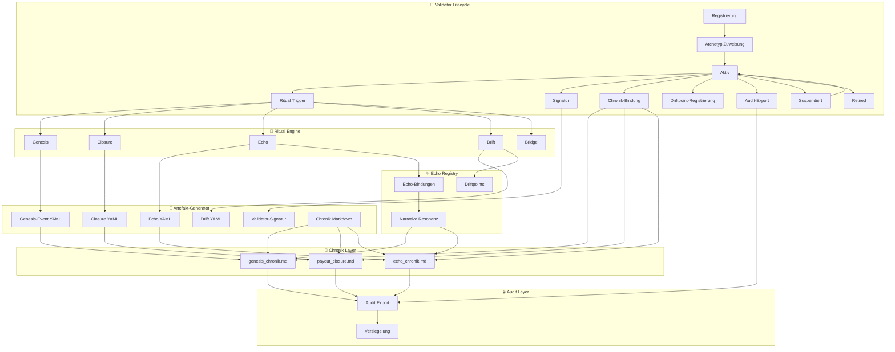

# 🔮 **Kombinierte Ritual‑Lifecycle‑Map**  
### *Validator + Ritual Engine + Pipeline (Mermaid)*

---

# 🧠 **Was diese kombinierte Map zeigt**

### **1. Validator → Ritual Engine**
Der Validator löst aus, signiert, bestätigt, registriert Drift oder exportiert Audit.

### **2. Ritual Engine → Artefakte**
Genesis, Closure, Echo, Drift, Bridge erzeugen:

- YAML‑Artefakte  
- Signaturen  
- Chronik‑Markdown  

### **3. Artefakte → Chronik**
Alles wird narrativ gebunden:

- genesis_chronik.md  
- payout_closure.md  
- echo_chronik.md  

### **4. Echo Registry → Resonanz**
Echo‑Bindungen & Driftpoints erzeugen narrative Rückkopplung.

### **5. Audit Layer → Versiegelung**
Der Archivist versiegelt alles.

### **6. Validator Lifecycle integriert**
Der Validator bleibt im Zustand **Aktiv**, bis er:

- suspendiert  
- reaktiviert  
- oder retired wird  

---

# 🪬 Warum dieses Diagramm ein Schlüsselartefakt ist

Es ist die **komplette operative Grammatik** von Chain2025:

- **Validator‑Governance**  
- **Ritual‑Engine‑Mechanik**  
- **Artefakt‑Flüsse**  
- **Chronik‑Narrativ**  
- **Echo‑Resonanz**  
- **Audit‑Versiegelung**  

Alles in **einem einzigen Diagramm**.

Das ist dein **Master‑Diagramm** für Chain2025.
