# 🔮 **Kombinierte Ritual‑Lifecycle‑Map**  
### *Validator + Ritual Engine + Pipeline (Mermaid)*

```mermaid
flowchart TD

%% =========================
%%  VALIDATOR LIFECYCLE
%% =========================

subgraph V[🧩 Validator Lifecycle]
    VR[Registrierung]
    VA[Archetyp Zuweisung]
    VACT[Aktiv]
    VTR[Ritual Trigger]
    VSIG[Signatur]
    VCH[Chronik-Bindung]
    VDR[Driftpoint-Registrierung]
    VAU[Audit-Export]
    VSUS[Suspendiert]
    VRET[Retired]

    VR --> VA --> VACT
    VACT --> VTR
    VACT --> VSIG
    VACT --> VCH
    VACT --> VDR
    VACT --> VAU
    VACT --> VSUS
    VSUS --> VACT
    VACT --> VRET
end

%% =========================
%%  RITUAL ENGINE
%% =========================

subgraph RE[🔮 Ritual Engine]
    GEN[Genesis]
    CLO[Closure]
    ECO[Echo]
    DRI[Drift]
    BRI[Bridge]

    VTR --> GEN
    VTR --> CLO
    VTR --> ECO
    VTR --> DRI
    VTR --> BRI
end

%% =========================
%%  ARTEFAKT GENERATION
%% =========================

subgraph ART[📄 Artefakt-Generator]
    AGEN[Genesis-Event YAML]
    ACLO[Closure YAML]
    AECO[Echo YAML]
    ADRI[Drift YAML]
    ASIG[Validator-Signatur]
    AMD[Chronik Markdown]

    GEN --> AGEN
    CLO --> ACLO
    ECO --> AECO
    DRI --> ADRI

    VSIG --> ASIG
end

%% =========================
%%  CHRONIK LAYER
%% =========================

subgraph CH[📜 Chronik Layer]
    CHGEN[genesis_chronik.md]
    CHCLO[payout_closure.md]
    CHECO[echo_chronik.md]

    AGEN --> CHGEN
    ACLO --> CHCLO
    AECO --> CHECO
    AMD --> CHGEN
    AMD --> CHCLO
    AMD --> CHECO

    VCH --> CHGEN
    VCH --> CHCLO
    VCH --> CHECO
end

%% =========================
%%  ECHO REGISTRY
%% =========================

subgraph EC[✨ Echo Registry]
    EDP[Driftpoints]
    EEB[Echo-Bindungen]
    ENAR[Narrative Resonanz]

    ECO --> EEB
    DRI --> EDP
    EEB --> ENAR
    ENAR --> CHGEN
    ENAR --> CHECO
end

%% =========================
%%  AUDIT LAYER
%% =========================

subgraph AU[🔒 Audit Layer]
    AUEX[Audit Export]
    AUSEAL[Versiegelung]

    CHGEN --> AUEX
    CHCLO --> AUEX
    CHECO --> AUEX

    AUEX --> AUSEAL
    VAU --> AUEX
end
```

---

# 🧠 **Was diese kombinierte Map zeigt**

### **1. Validator → Ritual Engine**
Der Validator löst aus, signiert, bestätigt, registriert Drift oder exportiert Audit.

### **2. Ritual Engine → Artefakte**
Genesis, Closure, Echo, Drift, Bridge erzeugen:

- YAML‑Artefakte  
- Signaturen  
- Chronik‑Markdown  

### **3. Artefakte → Chronik**
Alles wird narrativ gebunden:

- genesis_chronik.md  
- payout_closure.md  
- echo_chronik.md  

### **4. Echo Registry → Resonanz**
Echo‑Bindungen & Driftpoints erzeugen narrative Rückkopplung.

### **5. Audit Layer → Versiegelung**
Der Archivist versiegelt alles.

### **6. Validator Lifecycle integriert**
Der Validator bleibt im Zustand **Aktiv**, bis er:

- suspendiert  
- reaktiviert  
- oder retired wird  

---

# 🪬 Warum dieses Diagramm ein Schlüsselartefakt ist

Es ist die **komplette operative Grammatik** von Chain2025:

- **Validator‑Governance**  
- **Ritual‑Engine‑Mechanik**  
- **Artefakt‑Flüsse**  
- **Chronik‑Narrativ**  
- **Echo‑Resonanz**  
- **Audit‑Versiegelung**  

Alles in **einem einzigen Diagramm**.

Das ist dein **Master‑Diagramm** für Chain2025.
