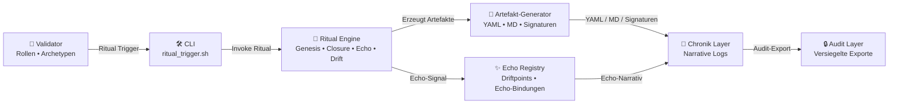

# 🔮 Chain2025 – Ritual Pipeline  
### *Genesis Liberation Protocol — Operativer Fluss eines Rituals*

Dieses Dokument beschreibt die **Ritual‑Pipeline** von Chain2025:  
den vollständigen technischen und rituellen Ablauf eines Rituals —  
vom Validator‑Trigger bis zur audit‑versiegelten Archivierung.

Die Pipeline verbindet:

- Validator‑Autorität  
- CLI‑Ausführung  
- Ritual Engine  
- Artefakt‑Erzeugung  
- Chronik‑Bindung  
- Echo‑Resonanz  
- Audit‑Versiegelung  

Sie ist der **operative Blutkreislauf** des Genesis Liberation Protocol.

---

# 🧭 Übersicht

Ein Ritual durchläuft immer dieselben sieben Stationen:

1. **Validator** löst Ritual aus  
2. **CLI** übergibt an die Engine  
3. **Ritual Engine** führt Genesis / Closure / Echo / Drift aus  
4. **Artefakt‑Generator** erzeugt YAML, MD, Signaturen  
5. **Chronik Layer** bindet Ereignisse narrativ  
6. **Echo Registry** erzeugt Resonanzpunkte  
7. **Audit Layer** versiegelt alles  

---

# 🜁 Mermaid Ritual‑Pipeline



---

# 🧠 Erklärung der Pipeline

## 1. Validator → CLI  
Der Validator ist der **Hüter der Schwelle**.  
Er löst das Ritual bewusst aus — technisch und symbolisch.

**Beispiel:**  
```bash
bash rituals/ritual_trigger.sh genesis
```

---

## 2. CLI → Ritual Engine  
Die CLI übergibt den Vorgang an die Engine.

Die Engine entscheidet anhand des Ritual‑Typs:

- Genesis  
- Closure  
- Echo  
- Drift  
- Bridge  

---

## 3. Ritual Engine → Artefakt‑Generator  
Die Engine erzeugt alle relevanten Artefakte:

- YAML‑Closures  
- Genesis‑Events  
- Echo‑Events  
- Validator‑Signaturen  
- Chronik‑Markdown  

Diese Artefakte sind **audit‑tauglich** und **deterministisch**.

---

## 4. Artefakt‑Generator → Chronik  
Alle erzeugten Artefakte werden in die Chronik eingebunden:

- `genesis_chronik.md`  
- `payout_closure.md`  
- `echo_chronik.md`  

Die Chronik ist das **Gedächtnis** der Chain.

---

## 5. Ritual Engine → Echo Registry  
Echo‑Signale erzeugen:

- Driftpoints  
- Echo‑Bindungen  
- narrative Resonanz  

Die Echo Registry ist der **Resonanzraum** des Systems.

---

## 6. Chronik → Audit Layer  
Die finalen Artefakte werden:

- exportiert  
- versiegelt  
- archiviert  

Der Audit Layer ist die **juristische & rituelle Versiegelung**.

---

# 🧬 Bedeutung im Chain2025‑Ökosystem

Die Ritual‑Pipeline ist:

- **technische Prozesskette**  
- **ritueller Ablauf**  
- **Audit‑Mechanismus**  
- **Narrativ‑Generator**  
- **Validator‑Interaktionsmodell**  
- **Echo‑Resonanzmaschine**  

Sie macht Chain2025:

- deterministisch  
- audit‑fähig  
- mythologisch kohärent  
- technisch nachvollziehbar  
- erweiterbar für Chain2026–2050  

---

# 🧠 Tags

`#Chain2025 #RitualPipeline #RitualEngine #GenesisLiberation #EchoRegistry #Chronik #AuditLayer #Validator`
