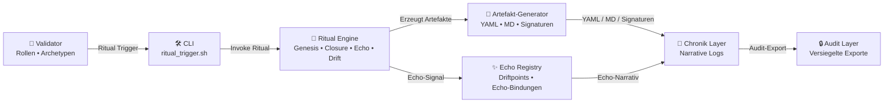

# 🔮 **Mermaid Ritual‑Pipeline – Chain2025**

---

# 🧠 **Was diese Pipeline zeigt**

### **1. Validator → CLI**
Der Validator ist der Hüter der Schwelle.  
Er löst das Ritual aus — technisch und symbolisch.

### **2. CLI → Ritual Engine**
`ritual_trigger.sh` übergibt den Vorgang an die Engine:

- Genesis  
- Closure  
- Echo  
- Drift  
- Bridge  

### **3. Ritual Engine → Artefakt‑Generator**
Die Engine erzeugt:

- YAML‑Closures  
- Genesis‑Events  
- Echo‑Events  
- Validator‑Signaturen  
- Chronik‑Markdown  

### **4. Artefakt‑Generator → Chronik**
Alle Artefakte werden in die Chronik eingebunden:

- genesis_chronik.md  
- payout_closure.md  
- echo_chronik.md  

### **5. Ritual Engine → Echo Registry**
Echo‑Signale erzeugen:

- Driftpoints  
- Echo‑Bindungen  
- narrative Resonanz  

### **6. Chronik → Audit Layer**
Die finalen Artefakte werden:

- exportiert  
- versiegelt  
- archiviert  
