# 🔮 **Mermaid Ritual‑Pipeline – Chain2025**

```mermaid
flowchart LR

    %% =========================
    %%  ACTORS
    %% =========================
    V["🧩 Validator<br/>Rollen • Archetypen"]
    CLI["🛠️ CLI<br/>ritual_trigger.sh"]
    RE["🔮 Ritual Engine<br/>Genesis • Closure • Echo • Drift"]
    ART["📄 Artefakt‑Generator<br/>YAML • MD • Signaturen"]
    CH["📜 Chronik Layer<br/>Narrative Logs"]
    EC["✨ Echo Registry<br/>Driftpoints • Echo‑Bindungen"]
    AU["🔒 Audit Layer<br/>Versiegelte Exporte"]

    %% =========================
    %%  PIPELINE FLOWS
    %% =========================

    V -->|Ritual Trigger| CLI
    CLI -->|Invoke Ritual| RE

    RE -->|Erzeugt Artefakte| ART
    ART -->|YAML / MD / Signaturen| CH

    RE -->|Echo‑Signal| EC
    EC -->|Echo‑Narrativ| CH

    CH -->|Audit‑Export| AU
```

---

# 🧠 **Was diese Pipeline zeigt**

### **1. Validator → CLI**
Der Validator ist der Hüter der Schwelle.  
Er löst das Ritual aus — technisch und symbolisch.

### **2. CLI → Ritual Engine**
`ritual_trigger.sh` übergibt den Vorgang an die Engine:

- Genesis  
- Closure  
- Echo  
- Drift  
- Bridge  

### **3. Ritual Engine → Artefakt‑Generator**
Die Engine erzeugt:

- YAML‑Closures  
- Genesis‑Events  
- Echo‑Events  
- Validator‑Signaturen  
- Chronik‑Markdown  

### **4. Artefakt‑Generator → Chronik**
Alle Artefakte werden in die Chronik eingebunden:

- genesis_chronik.md  
- payout_closure.md  
- echo_chronik.md  

### **5. Ritual Engine → Echo Registry**
Echo‑Signale erzeugen:

- Driftpoints  
- Echo‑Bindungen  
- narrative Resonanz  

### **6. Chronik → Audit Layer**
Die finalen Artefakte werden:

- exportiert  
- versiegelt  
- archiviert  
