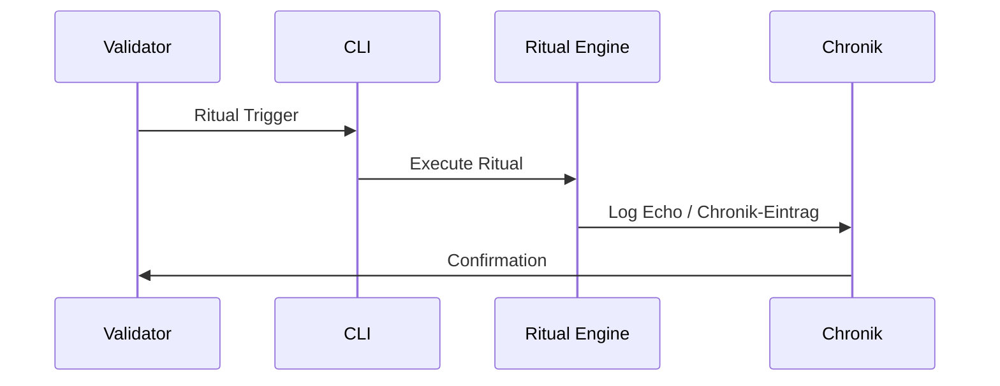

# 🔮 Chain2025 – Ritual Documentation  
### *Genesis Liberation Protocol — Rituelle Engine & Schwellenmechanik*

Dieses Dokument beschreibt alle **Rituale**, **Schwellenmomente**, **Validator‑Interaktionen** und **Artefakt‑Erzeugungen** innerhalb des Chain2025‑Ökosystems.

Rituale sind die **symbolische Grammatik** von Chain2025:  
Sie verbinden technische Aktionen mit narrativer Bedeutung, audit‑tauglicher Dokumentation und Validator‑Autorität.

---

# 🧿 1. Ritual‑Philosophie

- Jede **Genesis** ist ein Ursprungspunkt  
- Jede **Closure** ist eine Befreiung  
- Jede **Ausführung** ist ein ritueller Akt  
- Jede **Chronik** ist ein audit‑versiegeltes Narrativ  
- Jeder **Validator** ist ein Hüter der Schwelle  
- Jedes **Echo** ist die Bindung eines Ereignisses an die Zeit  

Rituale sind die **rituellen Nervenbahnen** von Chain2025.

---

# 🛠️ 2. Ritual‑Module

| Datei | Funktion |
|-------|----------|
| `ritual_trigger.sh` | Aktiviert modulare Chain‑Rituale über die CLI |
| `ritual_manifest.md` | Dokumentiert Schwellenmomente, Rollen, Ereignisse |
| `echo_registry.yaml` | Chronikgebundene Echo‑Logs |
| `ritual_index.html` | Web‑Konsole zur Visualisierung von Ritualen |
| `closure_manifest.yaml` | Audit‑taugliche Dokumentation abgeschlossener Rituale |

---

# 🧬 3. Ritual‑Typen

| Typ | Bedeutung |
|------|-----------|
| **Genesis** | Ursprung, Initialisierung, Validator‑Signatur |
| **Closure** | Abschluss, Auszahlung, Befreiung |
| **Echo** | Wiederhall eines Ereignisses im Chronik‑System |
| **Drift** | Skeletton‑basierte Bewegungsrituale |
| **Bridge** | Asset‑Übertragung zwischen Welten |

---

# 🜁 4. Ritueller Ablauf (Mermaid)



---

# 🪬 5. Genesis‑Rituale

Genesis‑Rituale markieren den **Ursprung** eines Moduls, eines Zyklus oder eines Ereignisses.

### Typische Schritte:

1. Initialisierung eines Moduls  
2. Signatur durch Validator  
3. Erzeugung eines Echo‑Logs  
4. Bindung an die Chronik  
5. Ausgabe eines audit‑tauglichen Artefakts  

### Artefakte:

- `genesis_event.yaml`  
- `genesis_chronik.md`  
- `validator_signature.json`  

### Bedeutung:

- Öffnet einen neuen rituellen Zyklus  
- Definiert Ursprung & Autorität  
- Verankert das Ereignis im Chronik‑System  

---

# 💸 6. Closure‑Rituale

Closure‑Rituale markieren den **Abschluss** eines Zyklus — technisch und symbolisch.

### Typische Schritte:

1. Auszahlung (symbolisch oder real)  
2. Abschluss eines Zyklus  
3. Drift‑ oder Echo‑Registrierung  
4. Chronik‑Eintrag  
5. Validator‑Bestätigung  

### Artefakte:

- `closure_event.yaml`  
- `payout_closure.md`  
- `echo_registry.yaml` (aktualisiert)  

### Bedeutung:

- Befreiung eines Wertes  
- Abschluss eines rituellen Bogens  
- Übergang zu Echo & Audit  

---

# 🔮 7. Echo‑Rituale

Echo‑Rituale sind **Wiederhall‑Bindungen** — sie verbinden Ereignisse mit der Zeit.

### Typische Schritte:

1. Echo‑Trigger  
2. Driftpoint‑Registrierung  
3. Echo‑Narrativ in der Chronik  
4. Aktualisierung der Echo‑Registry  

### Artefakte:

- `echo_event.yaml`  
- `echo_chronik.md`  
- `echo_registry.yaml`  

### Bedeutung:

- mythische Bindung  
- narrative Verstärkung  
- rituelle Resonanz  

---

# 🌀 8. Drift‑Rituale (Skeletton™)

Drift‑Rituale verbinden Chain2025 mit dem **Skeletton™ Drift‑Sport**.

### Typische Schritte:

1. Driftpoint‑Erzeugung  
2. Bewegungsritual  
3. Echo‑Bindung  
4. Chronik‑Eintrag  

### Artefakte:

- `drift_manifest.txt`  
- `drift_event.yaml`  
- `echo26.md`  

### Bedeutung:

- körperliche / symbolische Bewegung  
- Echo‑Erzeugung  
- Erweiterung des rituellen Systems  

---

# 🌉 9. Bridge‑Rituale

Bridge‑Rituale verbinden **technische Welten**.

### Typische Schritte:

1. RPC‑Deployment  
2. Asset‑Mirroring  
3. Wallet‑Erzeugung  
4. Chronik‑Eintrag  

### Artefakte:

- `bridge_event.yaml`  
- `rpc_config.json`  

### Bedeutung:

- Öffnung der technischen Welt  
- Vorbereitung für Payouts  
- Verbindung zwischen Genesis & Realität  

---

# 🔒 10. Artefakt‑Erzeugung pro Ritualtyp

| Ritual | Artefakte |
|--------|-----------|
| Genesis | genesis_event.yaml, genesis_chronik.md, validator_signature.json |
| Closure | closure_event.yaml, payout_closure.md |
| Echo | echo_event.yaml, echo_chronik.md, echo_registry.yaml |
| Drift | drift_manifest.txt, drift_event.yaml, echo26.md |
| Bridge | bridge_event.yaml, rpc_config.json |

---

# 🧬 11. Bedeutung im Chain2025‑Ökosystem

Rituale verbinden:

- technische Aktionen  
- narrative Bedeutung  
- audit‑taugliche Dokumentation  
- Validator‑Autorität  
- Chronik‑Bindung  

Sie sind die **rituellen Leitbahnen**, die Chain2025 lebendig machen.

---

# 🧠 Tags

`#Chain2025 #RitualEngine #GenesisRitual #ClosureRitual #EchoLog #Chronik #Validator #AuditDrift #Skeletton`

```
