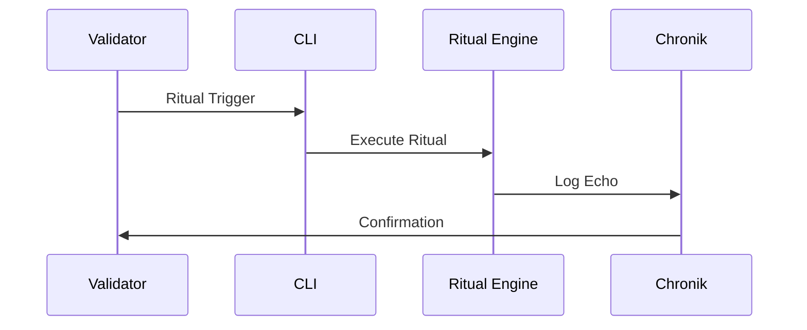

**Navigation:**  
[Index](index.md) • [Registry](registry.md) • [Architecture](architecture.md) • [Skeletton](skeletton.md) • [Audit](audit.md)

# 🔮 Chain Ritual Framework – Genesis & Closure Rituals
...
[⬅️ Zurück zur Übersicht](index.md)

```markdown
# 🔮 Chain Ritual Framework – Genesis & Closure Rituals

Das Chain Ritual Framework ist das rituelle Herz von Chain2025.  
Es verbindet technische Aktionen mit symbolischen Schwellenmomenten, Validator‑Rollen und chronikgebundenen Ereignissen.

Jedes Ritual ist ein audit‑versiegelter Akt, der sowohl technische als auch narrative Bedeutung trägt.

---

## 🧿 Ritual‑Philosophie

- Jede Genesis ist ein Ursprungspunkt  
- Jede Closure ist eine Befreiung  
- Jede Ausführung ist ein ritueller Akt  
- Jede Chronik ist ein audit‑versiegeltes Narrativ  
- Jeder Validator ist ein Hüter der Schwelle  

Rituale sind die **symbolische Grammatik** von Chain2025.

---

## 🛠️ Ritual‑Module

### `ritual_trigger.sh`
CLI‑Skript zur Aktivierung modularer Chain‑Rituale.

### `ritual_manifest.md`
Dokumentiert Schwellenmomente, Rollen, Ereignisse und Validator‑Beteiligung.

### `echo_registry.yaml`
Chronikgebundene Echo‑Logs für jedes Ritualereignis.

### `ritual_index.html`
Web‑Konsole zur Registrierung und Visualisierung von Ritualen.

---

## 🧬 Ritual‑Typen

| Typ       | Bedeutung |
|-----------|-----------|
| **Genesis** | Ursprung, Initialisierung, Validator‑Signatur |
| **Closure** | Abschluss, Auszahlung, Befreiung |
| **Echo** | Wiederhall eines Ereignisses im Chronik‑System |
| **Drift** | Skeletton‑basierte Bewegungsrituale |
| **Bridge** | Asset‑Übertragung zwischen Welten |

---

## 🧭 Ritual‑Ablauf (Mermaid)



---

## 🛠️ Ausführung eines Rituals

Ein Ritual wird typischerweise so ausgelöst:

```bash
bash rituals/ritual_trigger.sh
```

Der Ablauf:

1. Validator löst Ritual aus  
2. CLI übergibt an Ritual Engine  
3. Engine führt Genesis/Closure/Drift/Echo aus  
4. Chronik schreibt audit‑versiegelte Logs  
5. Validator erhält Bestätigung  

---

## 📜 Beispiel: Genesis‑Ritual

Ein Genesis‑Ritual kann beinhalten:

- Initialisierung eines Moduls  
- Signatur durch Validator  
- Erzeugung eines Echo‑Logs  
- Bindung an die Chronik  
- Ausgabe eines audit‑tauglichen Artefakts  

---

## 📜 Beispiel: Closure‑Ritual

Ein Closure‑Ritual kann beinhalten:

- Auszahlung (symbolisch oder real)  
- Abschluss eines Zyklus  
- Drift‑ oder Echo‑Registrierung  
- Chronik‑Eintrag  
- Validator‑Bestätigung  

---

## 🪬 Bedeutung im Chain2025‑Ökosystem

Rituale verbinden:

- technische Aktionen  
- narrative Bedeutung  
- audit‑taugliche Dokumentation  
- Validator‑Autorität  
- Chronik‑Bindung  

Sie sind die **rituelle Infrastruktur**, die Chain2025 lebendig macht.

---

## 🧠 Tags

`#Chain2025` `#RitualEngine` `#GenesisRitual` `#ClosureRitual`  
`#EchoLog` `#Chronik` `#Validator` `#AuditDrift`
```

---

Wenn du willst, mache ich dir jetzt auch:

- `docs/index.md` (Landing Page für alle Dokumente)  
- automatische interne Verlinkungen  
- ein komplettes GitHub‑Pages‑Dokumentationssystem  

Sag einfach Bescheid.
