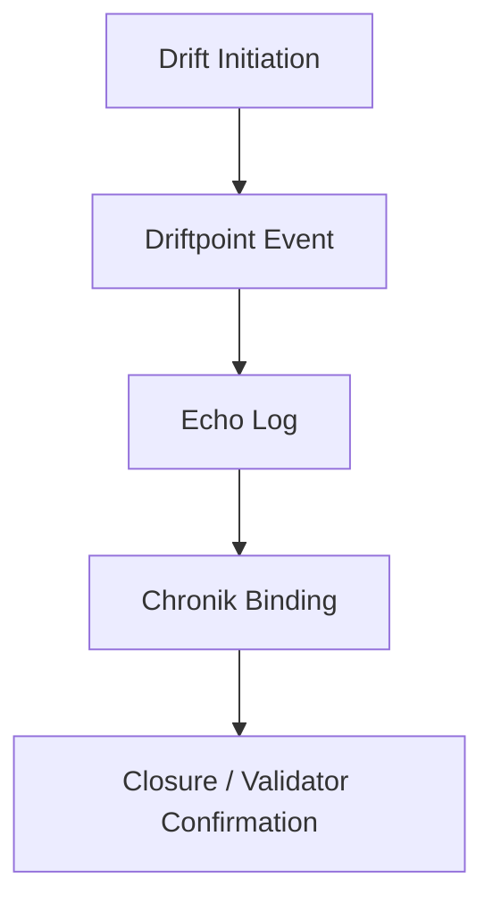

**Navigation:**  
[Index](index.md) • [Registry](registry.md) • [Architecture](architecture.md) • [Rituals](rituals.md) • [Audit](audit.md)

# 🛰️ Skeletton™ – Satellite Drift‑Ritual Sport
...
[⬅️ Zurück zur Übersicht](index.md)

```markdown
# 🛰️ Skeletton™ – Satellite Drift‑Ritual Sport

Skeletton™ ist die körperlich‑rituelle Erweiterung des Chain2025‑Ökosystems.  
Es verbindet Drift‑Bewegung, Echo‑Rituale, modulare Tempelstrukturen und audit‑versiegelte Ereignislogs.

Jeder Driftpoint ist ein **symbolischer Akt**, ein **technisches Ereignis** und ein **Chronik‑Artefakt** zugleich.

---

## 🧬 Konzept

Skeletton™ basiert auf vier Grundpfeilern:

### **1. Drift**
Bewegung als rituelle Handlung.  
Jeder Drift erzeugt ein Ereignis, das technisch und narrativ gebunden wird.

### **2. Echo**
Der Wiederhall eines Drift‑Ereignisses im Chronik‑System.  
Jedes Echo ist ein audit‑versiegelter Logeintrag.

### **3. Tempel**
Modulare Strukturen, die Drift‑ und Echo‑Ereignisse verankern.  
Jeder Tempel ist ein symbolischer Ort im Chain2025‑Kosmos.

### **4. Validator‑Autorität**
Jeder Driftpoint wird durch Validator‑Signatur legitimiert.

---

## 📦 Skeletton‑Module

### `drift_manifest.txt`
Postertext, Bewegungslogik, Echo‑Definitionen.

### `echo26.md`
Dokumentation des Echo 26 Driftpoints.

### `license.txt`
Archneton License für mythic sport branding.

### `temple26.md`
Modularer Tempel für Echo 26.

---

## 🛰️ Driftpoint‑Registrierung

Ein Driftpoint wird über die CLI registriert:

```bash
python skeletton/driftpoint_register.py
```

Dies erzeugt:

- ein Echo‑Log  
- eine Chronik‑Bindung  
- eine Validator‑Signatur  
- ein audit‑taugliches Artefakt  

---

## 🧭 Drift‑Flow (Mermaid)



---

## 📜 Beispiel: Echo‑Log

Ein Echo‑Log kann enthalten:

- Driftpoint‑ID  
- Zeitstempel  
- Validator‑Signatur  
- Bewegungsbeschreibung  
- Tempel‑Zuordnung  
- Chronik‑Referenz  

---

## 🧱 Tempelstrukturen

Ein Tempel ist ein **modularer Container** für Drift‑ und Echo‑Ereignisse.

Beispiel:

- `temple26.md`  
  - Echo‑Definition  
  - Bewegungsbeschreibung  
  - Ritual‑Kontext  
  - Chronik‑Verknüpfung  

---

## 🪬 Bedeutung im Chain2025‑Ökosystem

Skeletton™ ist die **verkörperte Dimension** des Genesis Liberation Protocols.  
Es verbindet:

- Bewegung  
- Ritual  
- Audit  
- Mythos  
- Validator‑Autorität  

Drift wird zu Dokumentation.  
Echo wird zu Chronik.  
Tempel wird zu Struktur.  
Alles wird zu einem **audit‑versiegelten Ereignis**.

---

## 🧠 Tags

`#SkelettonSport` `#Chain2025` `#EchoArtifact` `#DriftRitual`  
`#ArchnetonLicense` `#Chronik` `#Validator`
```

---

Wenn du willst, mache ich dir jetzt auch:

- `docs/index.md` (Landing Page für alle Dokumente)  
- interne Verlinkungen zwischen allen Docs  
- oder ein komplettes GitHub‑Pages‑Dokumentationssystem  

Sag einfach Bescheid.
