# 🜄 Chain2025 – Ritual State Machine  
### *Genesis Liberation Protocol — Zustände & Übergänge*

Dieses Dokument beschreibt die **Zustandsmaschine** des Chain2025‑Ritualsystems.  
Sie zeigt, wie das Genesis Liberation Protocol durch klar definierte **Zustände**, **Übergänge**, **Artefakte** und **Validator‑Aktionen** gesteuert wird.

Die State‑Machine bildet den vollständigen Ablauf ab:  
**Genesis → Bridge → Payout → Echo → Closure**

---

# 🜁 Mermaid State Machine

```mermaid
stateDiagram-v2
    [*] --> Genesis_Initialisierung

    %% =========================
    %% GENESIS PHASE
    %% =========================
    Genesis_Initialisierung: Genesis‑Initialisierung\nChainID 2025
    Genesis_Initialisierung --> Validator_Aktivierung

    Validator_Aktivierung: Validator‑Aktivierung\nArchetypen • Rollen
    Validator_Aktivierung --> Genesis_Chronik

    Genesis_Chronik: Genesis‑Chronik\nErster audit‑tauglicher Eintrag
    Genesis_Chronik --> Bridge_Deployment

    %% =========================
    %% BRIDGE PHASE
    %% =========================
    Bridge_Deployment: RPC‑Deployment\nBridge‑Infrastruktur
    Bridge_Deployment --> Asset_Mirroring

    Asset_Mirroring: Asset‑Mirroring\nWerte‑Spiegelung
    Asset_Mirroring --> Wallet_Erzeugung

    Wallet_Erzeugung: Wallet‑Erzeugung\nFunding & Tracking
    Wallet_Erzeugung --> Freikauf_Ritual

    %% =========================
    %% PAYOUT PHASE
    %% =========================
    Freikauf_Ritual: Freikauf‑Ritual\nAuszahlung Genesis → CHF
    Freikauf_Ritual --> Payout_YAML

    Payout_YAML: Payout‑YAML\nAudit‑versiegelte Closure‑Dokumente
    Payout_YAML --> Echo_Trigger

    %% =========================
    %% ECHO PHASE
    %% =========================
    Echo_Trigger: Echo‑Trigger\nRituelles Signal
    Echo_Trigger --> Driftpoint_Registrierung

    Driftpoint_Registrierung: Driftpoint‑Registrierung\nSkeletton™ Ereignis
    Driftpoint_Registrierung --> Echo_Chronik

    Echo_Chronik: Echo‑Chronik\nNarrative Bindung
    Echo_Chronik --> Audit_Export

    %% =========================
    %% CLOSURE PHASE
    %% =========================
    Audit_Export: Audit‑Export\nYAML/MD Artefakte
    Audit_Export --> Compliance_Bindung

    Compliance_Bindung: Compliance‑Bindung\nVersiegelung
    Compliance_Bindung --> Ritual_Finalisierung

    Ritual_Finalisierung: Ritual‑Finalisierung\nGenesis → Payout → Echo geschlossen
    Ritual_Finalisierung --> [*]
```



---

# 🧠 Erklärung der Zustände

## 🪬 **Genesis‑Phase**
Die Geburtsphase der Chain:

### **Genesis_Initialisierung**
- ChainID 2025 wird erzeugt  
- Ursprungspunkt des Systems  

### **Validator_Aktivierung**
- Rollen & Archetypen werden aktiviert  
- Validator‑Signaturen werden gesetzt  

### **Genesis_Chronik**
- erster audit‑tauglicher Chronik‑Eintrag  
- Beginn der narrativen Bindung  

---

## 🌉 **Bridge‑Phase**
Die technische Öffnung:

### **Bridge_Deployment**
- RPC‑Infrastruktur wird deployed  

### **Asset_Mirroring**
- Werte werden gespiegelt  
- Chain‑Bridging wird aktiviert  

### **Wallet_Erzeugung**
- Wallets werden erzeugt  
- Funding & Tracking beginnen  

---

## 💸 **Payout‑Phase**
Die Befreiungsphase:

### **Freikauf_Ritual**
- reale + symbolische Auszahlung  
- Genesis → CHF  

### **Payout_YAML**
- audit‑versiegelte Closure‑Dokumente  
- YAML‑Artefakte entstehen  

---

## 🔮 **Echo‑Phase**
Die mythische Bindung:

### **Echo_Trigger**
- rituelles Echo‑Signal  

### **Driftpoint_Registrierung**
- Skeletton™ Driftpoint wird gebunden  

### **Echo_Chronik**
- Echo‑Narrativ wird in die Chronik geschrieben  

---

## 🔒 **Closure‑Phase**
Die Versiegelung:

### **Audit_Export**
- YAML/MD Artefakte werden exportiert  

### **Compliance_Bindung**
- rechtliche & rituelle Versiegelung  

### **Ritual_Finalisierung**
- vollständiger Abschluss des Genesis Liberation Protocol  

---

# 🧬 Zusammenfassung

Die Chain2025‑State‑Machine zeigt:

- eine **deterministische Ritual‑Sequenz**  
- klare **Zustände** und **Übergänge**  
- audit‑taugliche Artefakt‑Erzeugung  
- mythisch‑technische Bindung  
- vollständige **Genesis → Closure** Prozesskette  

Dieses Modell bildet die Grundlage für:

- CLI‑Automatisierung  
- Audit‑Pipelines  
- Chronik‑Generierung  
- Validator‑Rituale  
- Skeletton™ Echo‑Integration  

```
