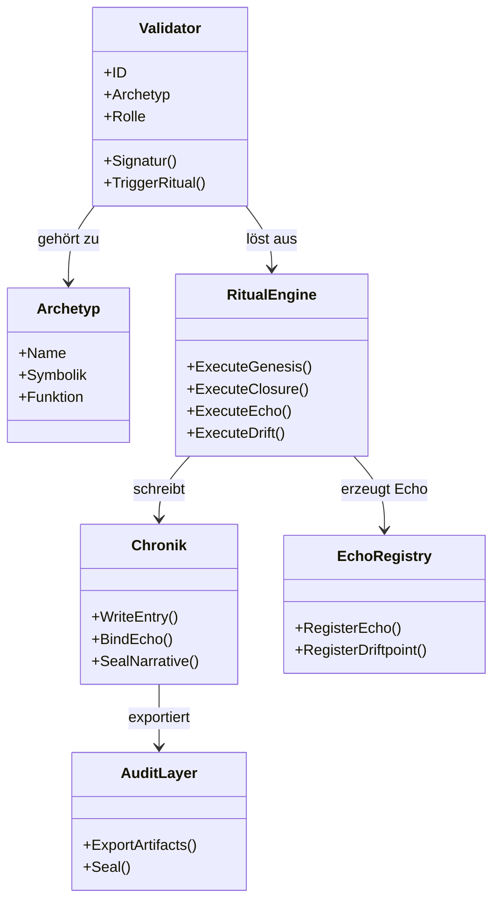
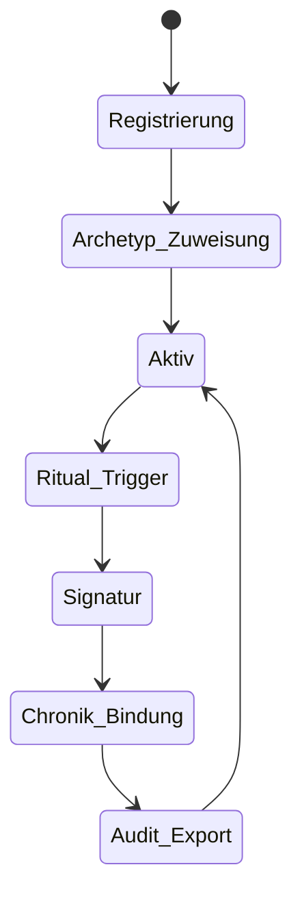

# 🧩 Chain2025 – Validatoren & Archetypen  
### *Rollen, Archetypen, Signaturen & rituelle Autorität*

Validatoren sind die **Hüter der Schwelle** im Chain2025‑Ökosystem.  
Sie verbinden technische Ausführung mit ritueller Bedeutung und garantieren die Integrität jedes Genesis‑, Closure‑ und Echo‑Rituals.

Dieses Dokument beschreibt:

- Validator‑Rollen  
- Archetypen  
- Signatur‑Mechanik  
- rituelle Verantwortlichkeiten  
- Interaktion mit Ritual Engine, Chronik & Audit Layer  

---

# 🪬 1. Validator‑Philosophie

Ein Validator ist mehr als ein technischer Akteur.  
Er ist:

- **Zeuge** eines Ereignisses  
- **Hüter** eines Ursprungs  
- **Schmied** eines Artefakts  
- **Bote** zwischen Welten  
- **Chronist** der Geschichte  
- **Richter** über Closure  
- **Träger** von Drift & Echo  

Validatoren sind die **rituellen Autoritäten** von Chain2025.

---

# 🧬 2. Validator‑Archetypen‑Matrix

Jeder Validator trägt einen Archetyp, der seine symbolische und funktionale Rolle definiert.

| Archetyp | Symbolische Bedeutung | Funktion im System |
|----------|------------------------|---------------------|
| **Hüter** | Bewahrer der Schwelle, Schutz des Ursprungs | Validiert Genesis‑Rituale, schützt Ursprung & ChainID |
| **Zeuge** | Beobachter des Wandels, Garant der Transparenz | Bestätigt Chronik‑Einträge, überwacht Artefakt‑Erzeugung |
| **Schmied** | Gestalter, der Form aus Energie schafft | Erzeugt Artefakte (YAML, MD, Signaturen), bindet sie an die Engine |
| **Bote** | Überbringer zwischen Welten | Triggert Bridge‑Rituale, übergibt RPC‑Signale & Wallet‑Events |
| **Chronist** | Hüter des Gedächtnisses | Schreibt Genesis‑, Payout‑ und Echo‑Chroniken |
| **Drift‑Träger** | Verkörperung der Bewegung | Registriert Driftpoints, erzeugt Echo‑Resonanz im Skeletton‑Layer |
| **Richter** | Wächter der Ordnung | Prüft Closure‑Rituale, bestätigt Befreiungen & Auszahlungen |
| **Seher** | Deuter von Echo‑Signalen | Interpretiert Echo‑Bindungen, aktualisiert Echo‑Registry |
| **Archivist** | Bewahrer der finalen Form | Exportiert & versiegelt Artefakte im Audit‑Layer |

---

# 🔮 3. Validator‑Rollenkarte (Mermaid Class Diagram)



---

# 🛠️ 4. Validator‑Mechanik

## 🔹 Signatur
Jeder Validator besitzt eine **eindeutige Signatur**, die:

- Genesis‑Rituale bestätigt  
- Closure‑Rituale autorisiert  
- Echo‑Ereignisse legitimiert  

Signaturen sind **audit‑taugliche Artefakte**.

---

## 🔹 Ritual‑Trigger

Ein Validator löst Rituale aus über:

```bash
bash rituals/ritual_trigger.sh <ritual>
```

Beispiele:

- `genesis`  
- `closure`  
- `echo`  
- `drift`  
- `bridge`  

---

## 🔹 Artefakt‑Erzeugung

Validatoren sind direkt oder indirekt beteiligt an:

- YAML‑Closures  
- Genesis‑Events  
- Echo‑Events  
- Drift‑Registrierungen  
- Chronik‑Markdown  
- Audit‑Exports  

---

# 🌀 5. Validator‑Lifecycle (Mermaid State Machine)



---

# 📜 6. Validator‑Artefakte

| Artefakt | Beschreibung |
|----------|--------------|
| `validator_signature.json` | Signatur eines Rituals |
| `validator_manifest.yaml` | Rollen, Archetyp, Berechtigungen |
| `chronik_*.md` | Chronik‑Einträge, die Validatoren bestätigen |
| `echo_registry.yaml` | Echo‑Bindungen, die Validatoren auslösen |

---

# 🧬 7. Bedeutung im Chain2025‑Ökosystem

Validatoren sind:

- **technische Autoritäten**  
- **rituologische Instanzen**  
- **narrative Träger**  
- **audit‑relevante Akteure**  
- **Bindeglieder zwischen Genesis & Closure**  
- **Erzeuger von Echo & Drift**  

Ohne Validatoren gibt es **keine Rituale**,  
ohne Rituale gibt es **keine Chain2025**.

---

# 🧠 Tags

`#Chain2025 #Validator #Archetypen #RitualEngine #GenesisLiberation #EchoRegistry #Chronik #AuditLayer`
