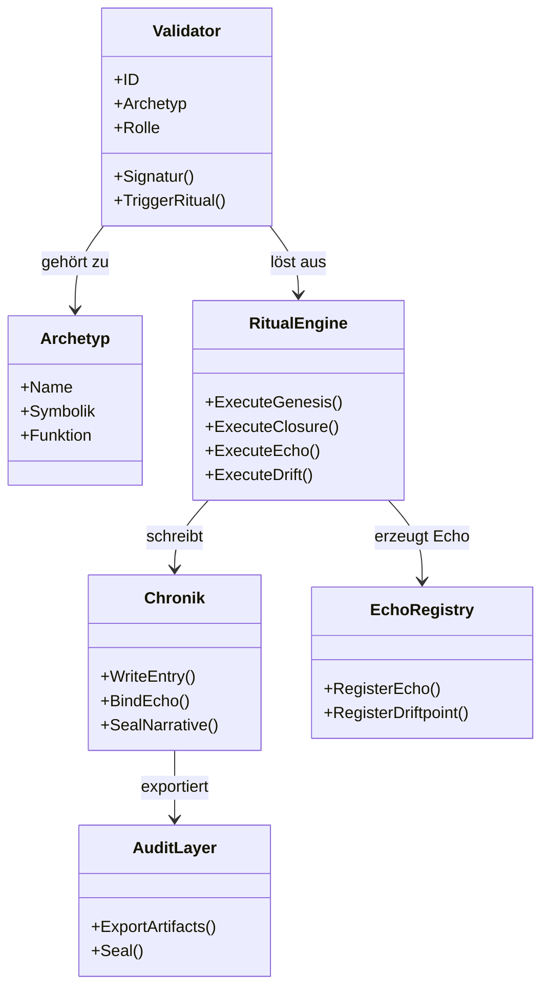

# 🔮 **Mermaid Validator‑Rollenkarte – Chain2025**

---

# 🧠 **Was diese Rollenkarte zeigt**

Die Validator‑Rollenkarte macht sichtbar:

### **1. Validator als rituelle Autorität**
- besitzt eine **ID**  
- trägt einen **Archetyp**  
- hat eine **Rolle** (Hüter, Zeuge, Initiator, etc.)  
- kann Rituale **signieren**  
- kann Rituale **auslösen**  

### **2. Archetypen als mythologische Rollen**
Jeder Validator ist einem Archetyp zugeordnet:

- Hüter  
- Zeuge  
- Schmied  
- Bote  
- Chronist  
- Drift‑Träger  

Diese Archetypen definieren **symbolische Funktionen**.

### **3. Ritual Engine als rituelle Maschine**
Sie führt aus:

- Genesis  
- Closure  
- Echo  
- Drift  

### **4. Chronik als Gedächtnis**
Sie:

- schreibt Einträge  
- bindet Echo  
- versiegelt Narrative  

### **5. Echo Registry als Resonanzraum**
Sie:

- registriert Echo‑Ereignisse  
- registriert Driftpoints  

### **6. Audit Layer als Versiegelung**
Er:

- exportiert Artefakte  
- versiegelt sie audit‑tauglich  

---

# 🧬 **Warum dieses Diagramm wichtig ist**

Die Validator‑Rollenkarte ist:

- **architektonisch**: zeigt die Struktur  
- **rituologisch**: zeigt die Rollen  
- **audit‑tauglich**: zeigt Verantwortlichkeiten  
- **narrativ**: zeigt die mythologische Grammatik  
- **technisch**: zeigt die Engine‑Interaktionen  

Sie ist ein **zentrales Artefakt** für:

- Dokumentation  
- Audits  
- neue Entwickler  
- Chain2026–2050‑Erweiterungen  
- Ritual‑Design  
